# Project-17 - Shopify Web App's-Landing-Page

## Description:

> A humble attempt to replicate and develop a fully-responsive Landing Page of Shopify Web App using Tailwind CSS and its few Component Libraries like Tailwind UI, Mamba UI and FLowbite Blocks.

# 

**Landing-Page-Images:**

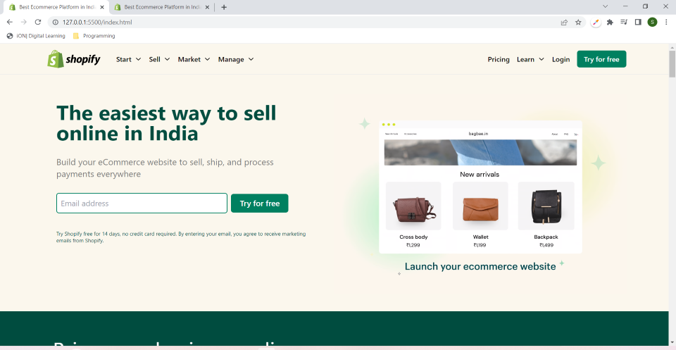

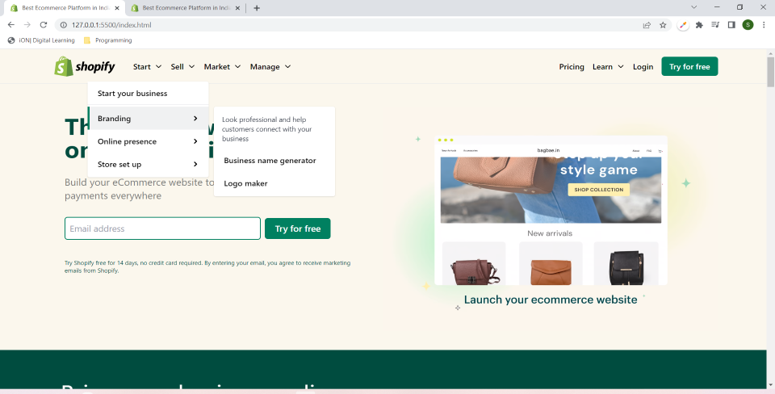

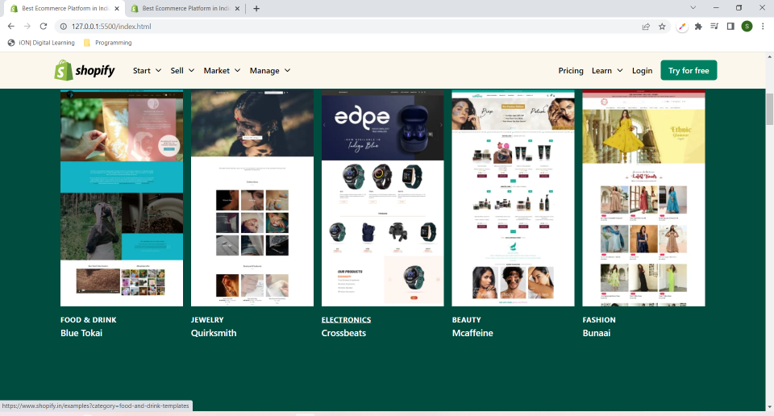

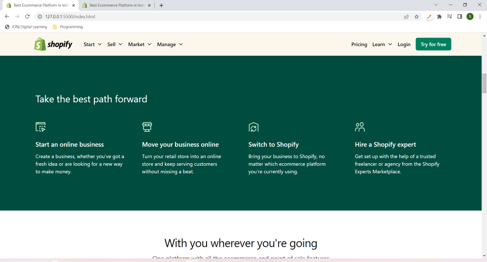

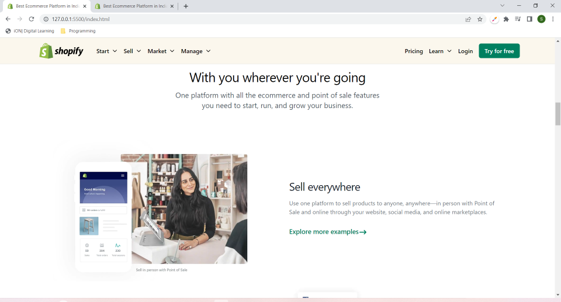

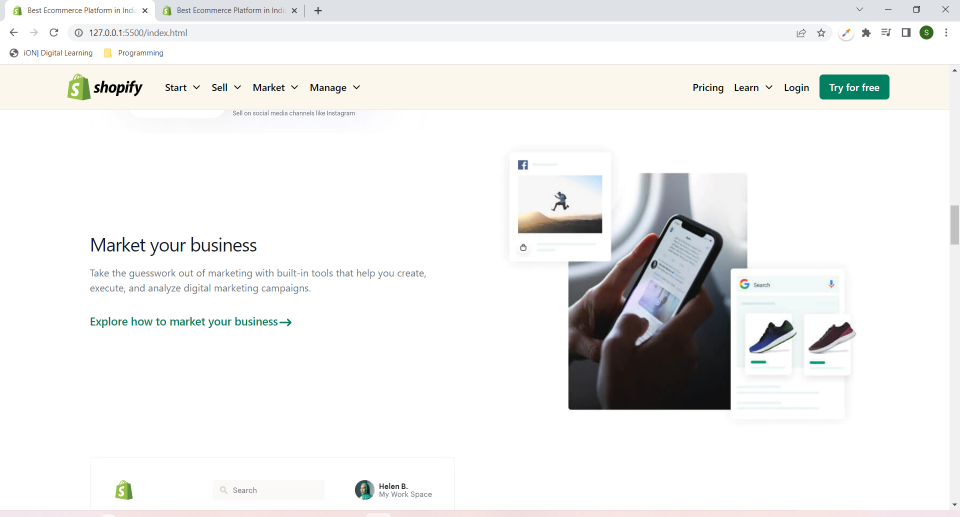

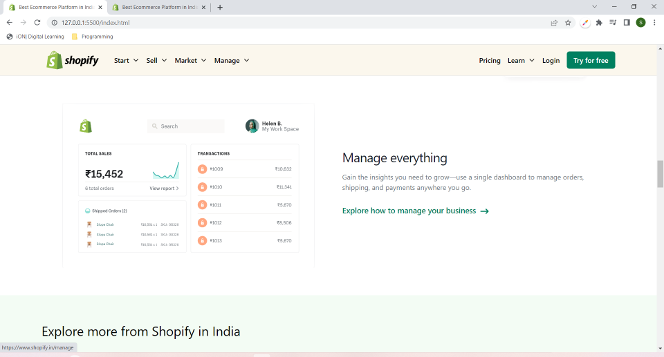

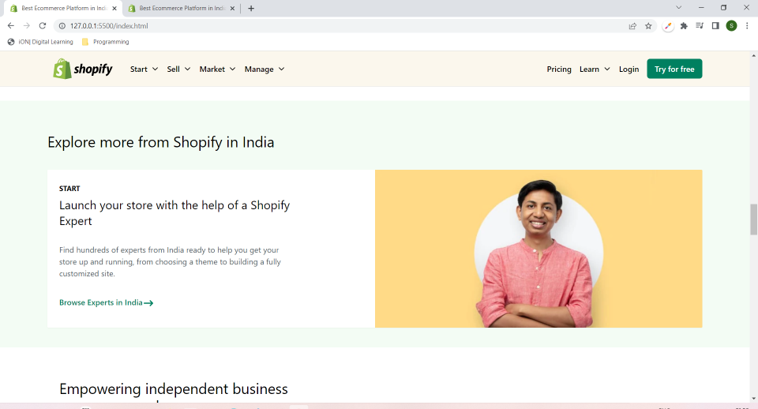

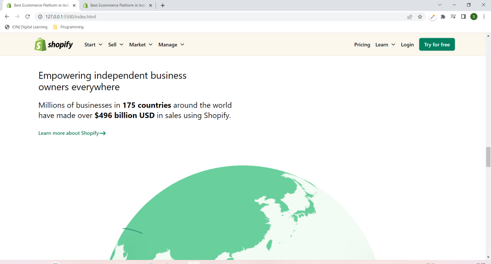

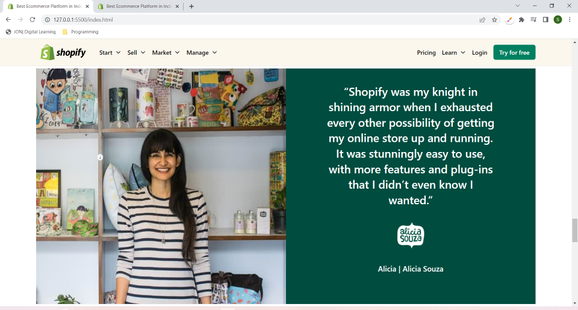

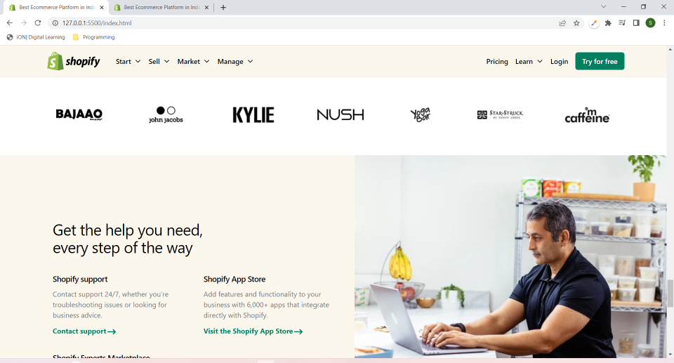

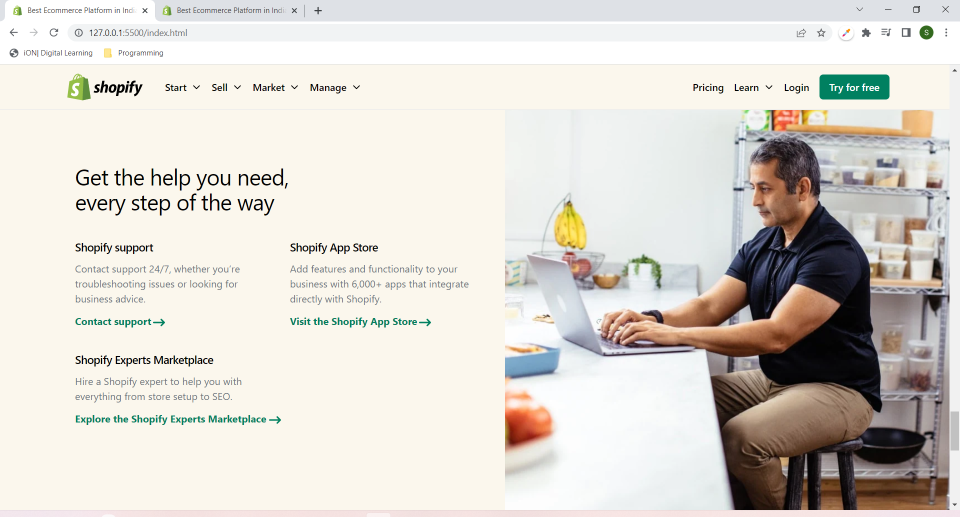

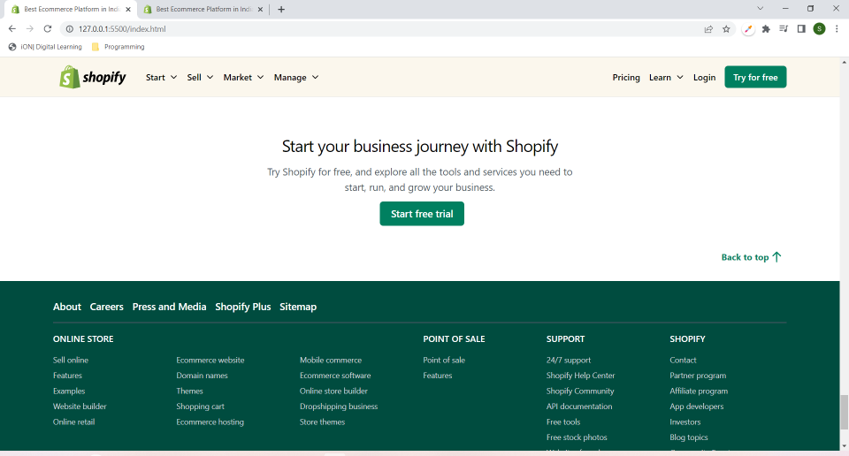

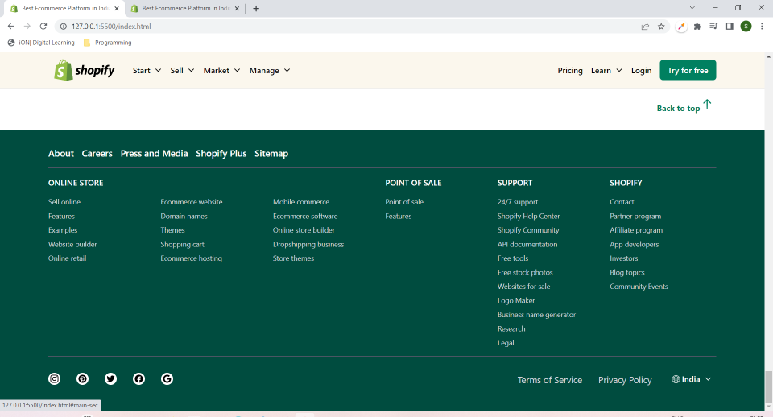

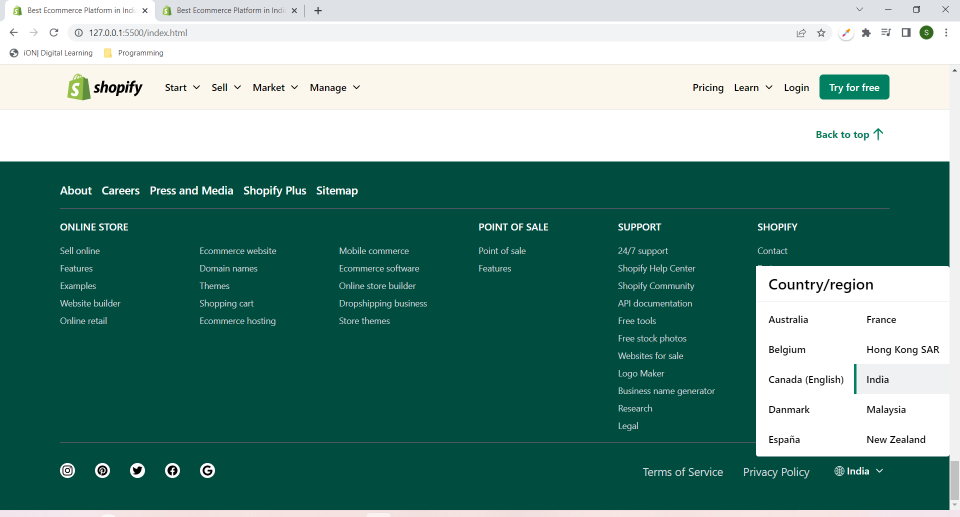

#

## What I have learnt while making this project?

> I have gotten used to using Tailwind CSS classes and referring to its documentation, but in this project, for the first time, I tried to use few Tailwind component libraries also, which was quite challenging as it required to understand the existing component code and making the changes accordingly as per the needs, which took a quite some time. But I got to learn a lot and finally I have completed it. Now on to the next one :D 

#

## Time taken to complete this project:
> Around 18 hrs, spread over the last two days, were spent in developing this fully-reponsive Landing Page of Shopify.

#

## Please see this project in action at below link:

**[Click to redirect to Project-17-Shopify](https://p17-shopify.netlify.app/)**

#

## Developed by:

**Sidharth Pandey**

**[Contact Me](mailto:sidp0008@gmail.com)**

#